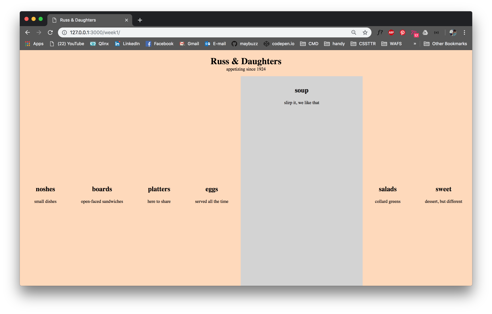
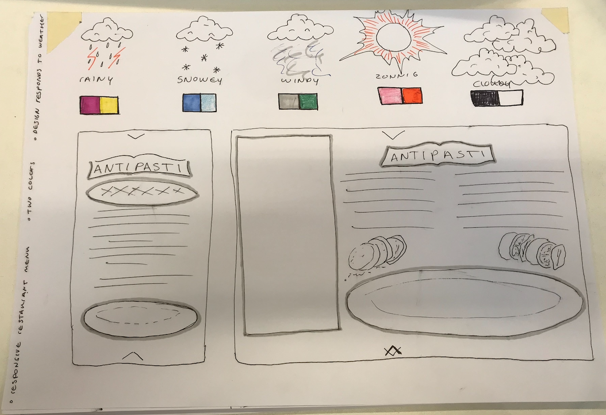
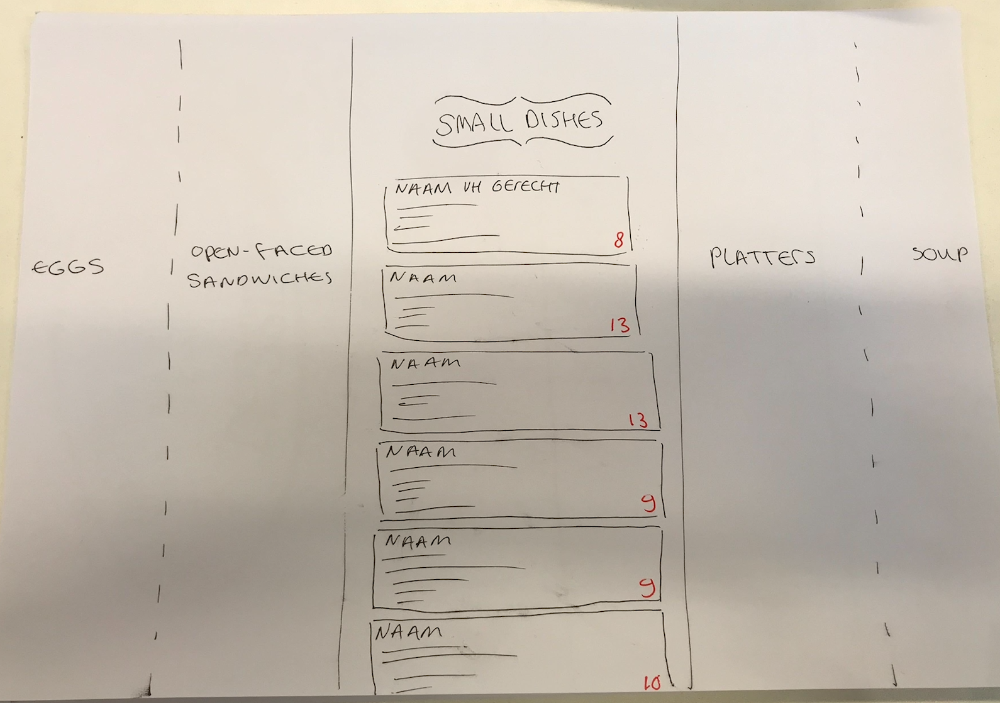
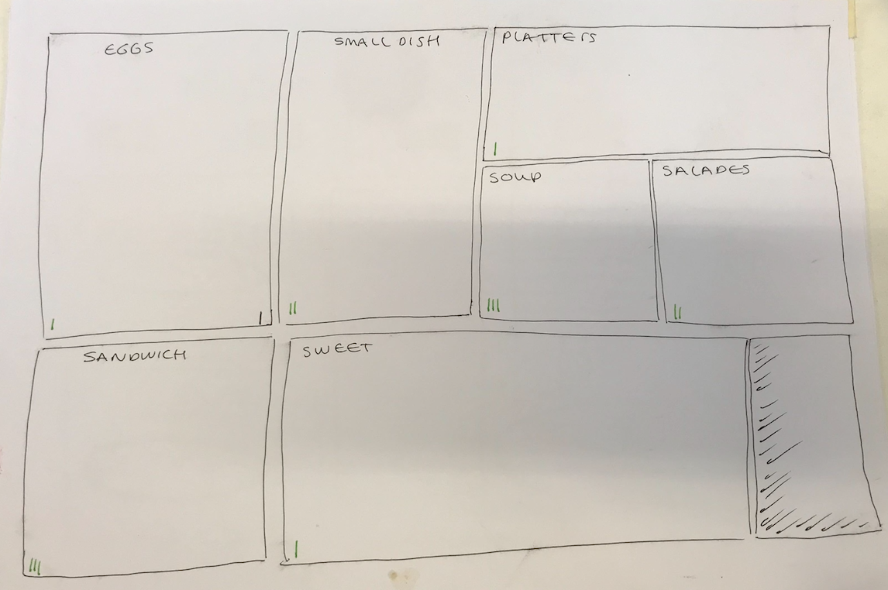

# CSS to the rescue

## Table of contents
1. [Introduction](#Introduction)
2. [Install](#Install)
3. [Assignment](#Assignment)
4. [Concepts](#Concepts)
5. [Iterations](#Iterations)
6. [To-do](#To-do)
7. [Resources](#Resources)

## Introduction
For this assignment I chose to create a responsive restaurant menu, using several restrictions. I'm going to work with BEM syntax. [Click here](#Assignment) for more information about the assignment.

## Install

## Assignment
Create a responsive restaurant menu using only **two colours** (restriction 1) and a **design that responds to weather** (restriction 2). I'm going to write my CSS using the **BEM** methodology.  

## Concepts

### Concept 1: Illustrations

### Concept 2: Bars

### Concept 3: Puzzle

## Iterations

## To-do
- [x] Pick an assignment   
- [x] Pick two restrictions   
- [ ] Brainstorm ideas   
- [ ] Create a solid concept   
- [ ] Create CodePens to try out ideas   
- [ ] Use BEM syntax   
- [ ] Add CSS animations & transitions   
- [ ] Design responds to weather   
- [ ] Workout desktop version   
- [ ] Workout mobile version   
- [ ] Workout tablet version   
- [ ] **Don't**/Limit use of JavaScript

## Resources
- [My CodePen](https://codepen.io/maybuzz/)   
- [BEM documentation](http://getbem.com/)   
- [Getting your head around BEM syntax](https://csswizardry.com/2013/01/mindbemding-getting-your-head-round-bem-syntax/)   
- [Menu example](https://ambiance.vagebond.nl/html/template/grill/)   

## License
[MIT](LICENSE) © [Luna May Johansson](https://github.com/maybuzz)
